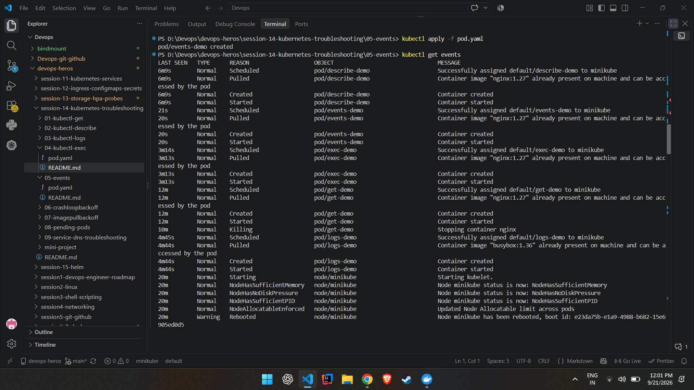
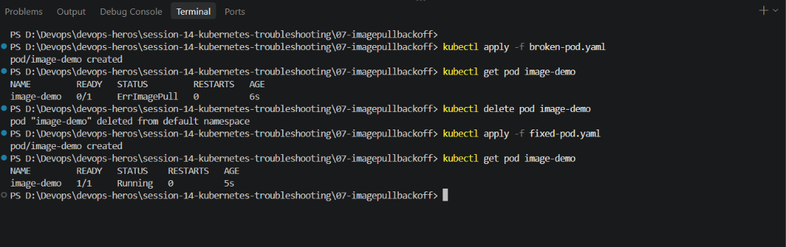
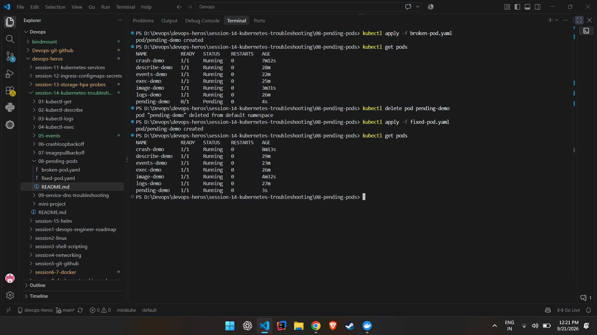
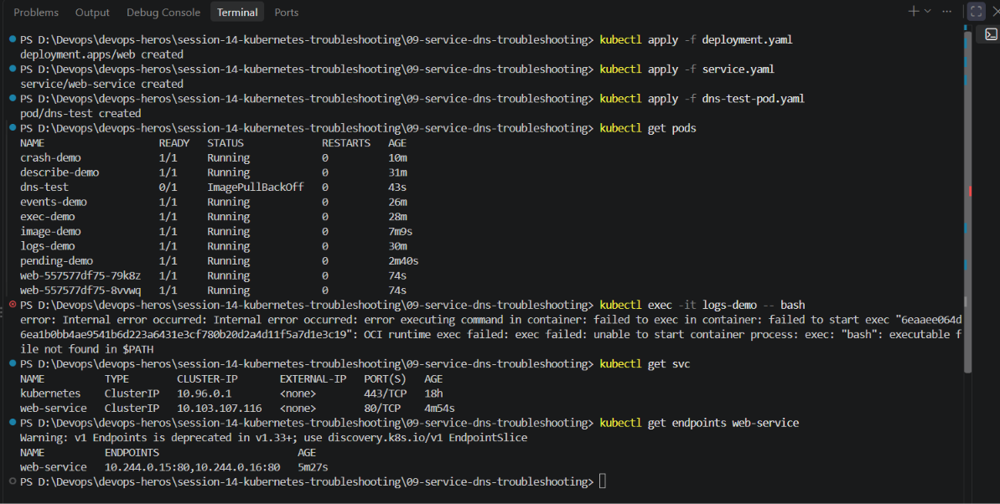
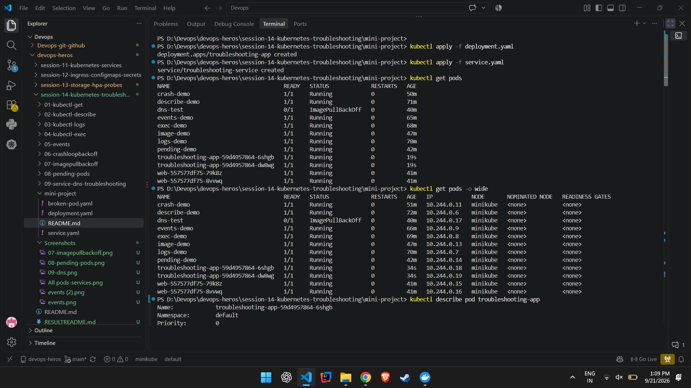

# Kubernetes Events

# All pods screenshot


## 1. Create the Pod

```bash
kubectl apply -f pod.yaml
```

## 2. Check Events

Run:

```bash
kubectl get events
```

# Screenshot output


---
.png>)

---
# `ImagePullBackOff`

```bash
ImagePullBackOff
```

---

## 1. Create The Broken Pod

```bash
kubectl apply -f broken-pod.yaml
```

Check:

```bash
kubectl get pod image-demo
```

---

## 2. Describe The Pod

Run:

```bash
kubectl describe pod image-demo
```

## 3. Fix The Image

Delete the broken Pod:

```bash
kubectl delete pod image-demo
```

Apply the fixed YAML:

```bash
kubectl apply -f fixed-pod.yaml
```

Check:

```bash
kubectl get pod image-demo
```

---
# Screenshot output



#  `Pending` Pods

## 1. Create The Broken Pod

```bash
kubectl apply -f broken-pod.yaml
```

Check:

```bash
kubectl get pod pending-demo
```
---

## 2. Why Is It Pending?

Run:

```bash
kubectl describe pod pending-demo
```
---

## 3. Check Nodes

Run:

```bash
kubectl get nodes
```

## 4. Fix The Pod

Delete:

```bash
kubectl delete pod pending-demo
```

Apply:

```bash
kubectl apply -f fixed-pod.yaml
```

Check:

```bash
kubectl get pod pending-demo
```

Expected output:

# Screenshot output


---
# Service & DNS


## 1. Create The Application

Apply:

```bash
kubectl apply -f deployment.yaml
```

Check:

```bash
kubectl get pods
```
## 2. Create The Service

Apply:

```bash
kubectl apply -f service.yaml
```

Check:

```bash
kubectl get service
```
---
## 3. Check Service Details

Run:

```bash
kubectl describe service web-service
```

Important things to check:
* **Selector**
* **Port**
* **TargetPort**
* **Endpoints**

---

## 4. Check Endpoints

Run:

```bash
kubectl get endpoints web-service
```
---
# Screenshot output


---

# Kubernetes Troubleshooting miniproject

## Objective

Learn the Kubernetes troubleshooting workflow:

```text
Deploy
  │
  ▼
Observe
  │
  ▼
Break
  │
  ▼
Investigate
  │
  ▼
Find Root Cause
  │
  ▼
Fix
  │
  ▼
Verify
```

---

# Project Overview

This project contains:

- Deployment
- Service
- Pods
- Nginx Application

The goal is to identify and fix common Kubernetes issues involving Pods, Services, Images, and Networking.

---

# Step 1: Deploy the Application

Apply the deployment and service manifests:

```bash
kubectl apply -f deployment.yaml
kubectl apply -f service.yaml
```

Verify resources:

```bash
kubectl get pods
kubectl get service
```

### Output


---

# Step 2: Inspect the Running Pod

View pod details:

```bash
kubectl get pods -o wide
```

Describe the pod:

```bash
kubectl describe pod <pod-name>
```

Check logs:

```bash
kubectl logs <pod-name>
```

Access the container:

```bash
kubectl exec -it <pod-name> -- sh
```

Test Nginx inside the container:

```bash
curl localhost
```

### Output

.png)

---

# Step 3: Inspect the Service

View service information:

```bash
kubectl get service
```

Describe the service:

```bash
kubectl describe service troubleshooting-service
```

Verify:

- Selector
- TargetPort
- Endpoints

### Output

.png)

---

# Step 4: Check Service Endpoints

Check if the Service has discovered the Pods:

```bash
kubectl get endpoints troubleshooting-service
```

Expected:

```text
Pod IP addresses should be listed.
```

# Step 5: Create a Broken Pod

Deploy the intentionally broken pod:

```bash
kubectl apply -f broken-pod.yaml
```

Check pod status:

```bash
kubectl get pod project-broken-pod
```

---

# Step 6: Investigate the Broken Pod

Check pod status:

```bash
kubectl get pod project-broken-pod
```

Describe the pod:

```bash
kubectl describe pod project-broken-pod
```

Inspect the Events section carefully.

### Output

.png)

---

# Troubleshooting Answers

## Question 1: What is the Pod Status?

**Answer:**

```text
ImagePullBackOff
```

---

## Question 2: What is the Actual Error?

**Answer:**

```text
Failed to pull image because the image name does not exist or is incorrect.
```

---

## Question 3: Which Command Helped Find the Reason?

**Answer:**

```bash
kubectl describe pod project-broken-pod
```

---

## Question 4: What is Wrong with the Image?

**Answer:**

```text
The image name/tag is incorrect.
Kubernetes cannot download the image.
```

---

## Question 5: How Would You Fix It?

**Answer:**

```text
Update the image field with a valid image name and redeploy the Pod.
```

Example:

```yaml
image: nginx:latest
```

---

# Step 7: Service Selector Troubleshooting

Modify the Service selector:

### Original

```yaml
selector:
  app: troubleshooting-app
```

### Broken Version

```yaml
selector:
  app: wrong-app
```

Apply the change:

```bash
kubectl apply -f service.yaml
```

Check service:

```bash
kubectl get service
```

Check endpoints:

```bash
kubectl get endpoints troubleshooting-service
```

Expected:

```text
<none>
```

### Output

.png)

---

# Step 8: Find the Root Cause

Check pod labels:

```bash
kubectl get pods --show-labels
```

Describe the service:

```bash
kubectl describe service troubleshooting-service
```

Compare:

- Pod Labels
- Service Selector

### Root Cause

```text
Service selector does not match Pod labels.
```

### Fix

Restore the correct selector:

```yaml
selector:
  app: troubleshooting-app
```

Apply again:

```bash
kubectl apply -f service.yaml
```

Verify:

```bash
kubectl get endpoints troubleshooting-service
```

# Troubleshooting Table

| Problem | What I Saw | Command I Used | Root Cause | Fix |
|----------|------------|----------------|------------|------|
| Broken Pod | Pod stuck in ImagePullBackOff | kubectl describe pod project-broken-pod | Invalid image name | Use valid image name |
| Service Problem | Endpoints showed `<none>` | kubectl get endpoints troubleshooting-service | Selector mismatch | Correct selector |
| Image Problem | Failed image pull events | kubectl describe pod project-broken-pod | Wrong image tag/name | Update image reference |

---

# README Questions

## 1. What does `kubectl get` tell us?

`kubectl get` displays the current state of Kubernetes resources such as Pods, Services, Deployments, and Nodes.

---

## 2. What is the difference between `get` and `describe`?

| Command | Purpose |
|----------|----------|
| kubectl get | Provides a summary view of resources |
| kubectl describe | Provides detailed information including events and configuration |

---

## 3. Why do we use `kubectl logs`?

To view application logs generated by containers for debugging and troubleshooting.

---

## 4. When would you use `kubectl exec`?

When you need to enter a running container to inspect files, processes, networking, or application behavior.

---

## 5. What does `CrashLoopBackOff` mean?

The container starts and crashes repeatedly. Kubernetes keeps retrying the restart.

---

## 6. What does `ImagePullBackOff` mean?

Kubernetes cannot pull the specified container image.

Common reasons:

- Incorrect image name
- Incorrect image tag
- Private registry access issue

---

## 7. Why can a Pod remain `Pending`?

Possible reasons:

- Insufficient resources
- Unschedulable node
- Missing Persistent Volume
- Image pull delays

---

## 8. Why can a Service have no endpoints?

Because no Pods match the Service selector.

---

## 9. What is the relationship between a Service selector and Pod labels?

A Service uses selectors to discover Pods. The selector values must match Pod labels.

Example:

```yaml
selector:
  app: nginx
```

Matches:

```yaml
labels:
  app: nginx
```

---

## 10. What is Kubernetes DNS?

Kubernetes DNS provides internal name resolution so Pods can communicate using Service names instead of IP addresses.

Example:

```bash
curl http://troubleshooting-service
```

---

# Final Architecture

```text
                    Kubernetes Cluster
                            │
                            ▼

                  ┌───────────────────┐
                  │      Service      │
                  └─────────┬─────────┘
                            │
                    Service Selector
                            │
              ┌─────────────┴─────────────┐
              │                           │
              ▼                           ▼

            Pod 1                       Pod 2
              │                           │
              └─────────────┬─────────────┘
                            │

                        Nginx App
```

---

# Important Troubleshooting Commands

## Pod Troubleshooting

```bash
kubectl get pods

kubectl describe pod <pod-name>

kubectl logs <pod-name>

kubectl exec -it <pod-name> -- sh

kubectl get events
```

---

## Service Troubleshooting

```bash
kubectl describe service <service-name>

kubectl get endpoints <service-name>

nslookup <service-name>
```

# Kubernetes Troubleshooting Mindset

```text
GET
 │
 ▼
DESCRIBE
 │
 ▼
EVENTS
 │
 ▼
LOGS
 │
 ▼
EXEC
 │
 ▼
TEST
 │
 ▼
FIX
 │
 ▼
VERIFY
```
